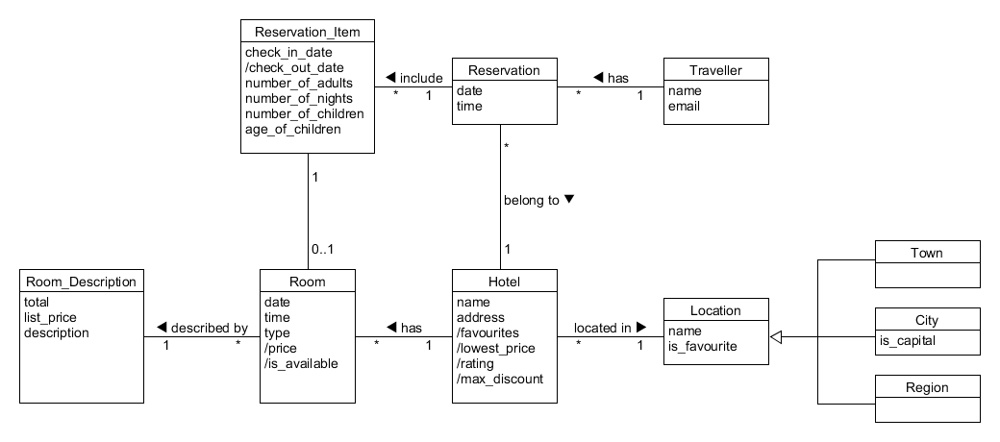
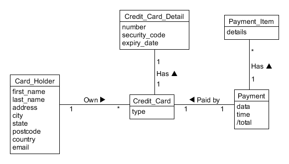
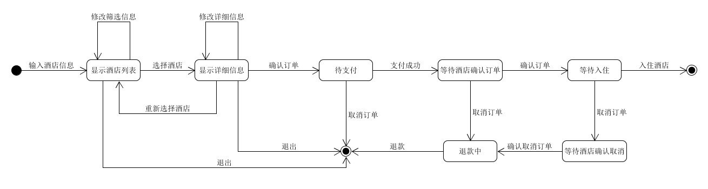

# 系统分析与设计第六次作业

使用 UMLet 建模

1. 使用类图，分别对 Asg_RH 文档中 Make Reservation 用例以及 Payment 用例开展领域建模。然后，根据上述模型，给出建议的数据表以及主要字段，特别是主键和外键  
    1. 注意事项：

        * 对象必须是名词、特别是技术名词、报表、描述类的处理；
        * 关联必须有多重性、部分有名称与导航方向
        * 属性要注意计算字段

        

        * Hotel(ID/key, Location/FKey, Name, Address, favourite, lowest_price, rating, max_discount)
        * Location(ID/Key, Name, is_favourite)
        * Room(ID/Key, Hotel_ID/FKey, Date, Time, Price, is_available)
        * Room_Description(Room_ID/FKey, Total, List_price, Description)
        * Traveller(ID/Key, Name, Email)
        * Reservation(ID/Key, Traveller_ID/FKey, Date, Time)
        * Reservation_Item(ID/Key, Reservation_ID/Fkey, Hotel_ID/FKey, Check_in_date, Check_out_date, Number_of_adults, Number_of_nights, Number_of_children, Age_of_children)

    2. 数据建模，为了简化描述仅需要给出表清单，例如：Hotel（ID/Key，Name，LoctionID/Fkey，Address..）

        

        * Payment (ID/Key, ReservationID/FKey, Date, Time, Total)
        * Payment_Item (ID/Key, Payment_ID/FKey, Details)
        * Credit_Card (ID/Key, Card_Holder_ID/FKey, Payment_ID/FKey, Type)
        * Credit_Card_Detail (ID/Key, Credit_Card_ID/FKey, Payment_Item_ID/FKey, Number, Security_code, Expiry_date)
        * Card_Holder(ID/Key, First_name, Last_name, Address, City, State, Postcode, Country, Email)

2. 使用 UML State Model，对每个订单对象生命周期建模  
建模对象： 参考 Asg_RH 文档， 对 Reservation/Order 对象建模。  
建模要求： 参考练习不能提供足够信息帮助你对订单对象建模，请参考现在 定旅馆 的旅游网站，尽可能分析围绕订单发生的各种情况，直到订单通过销售事件（柜台销售）结束订单。

