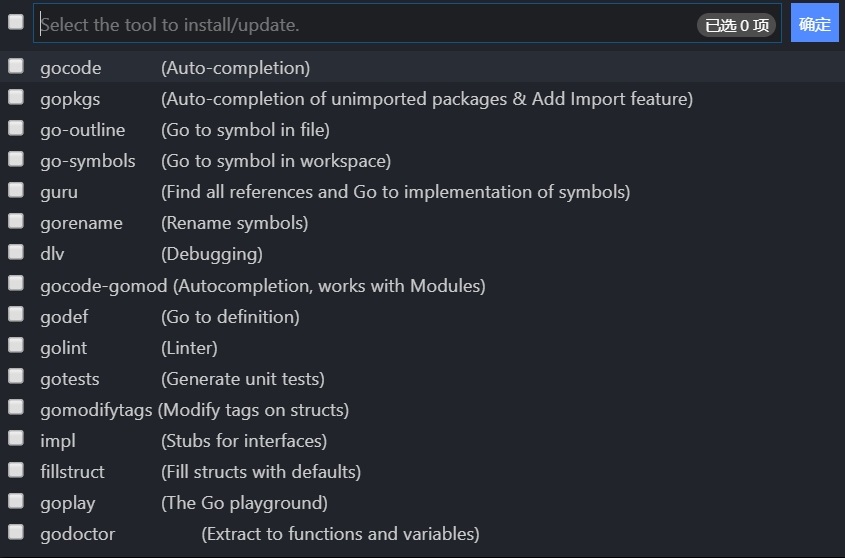
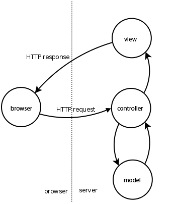

# 技术与工作报告 后端部分

16340253 谢浩峰

## Go语言环境的搭建

这次的项目后端使用的是Go语言，Go语言是Google开发的一种静态强类型、编译型、并发型，并具有垃圾回收功能的编程语言。  
这次后端环境主要使用的是JetBrain的Go语言IDE--GOLAND。环境的搭建主要包括了Windows下Go语言的安装以及GOLAND中的一些设置。

### Windows下Go的安装

从官网<https://golang.org/dl/>选择一个版本，根据指令安装即可。安装后要注意将```%GOROOT%```和```%GOPATH%```写入系统的环境变量。
我个人的设置的一部分：

```Powershell
set GOARCH=amd64
set GOBIN=
set GOCACHE=C:\Users\DELL\AppData\Local\go-build
set GOEXE=.exe
set GOFLAGS=
set GOHOSTARCH=amd64
set GOHOSTOS=windows
set GOOS=windows
set GOPATH=E:\课程\3\系统设计与分析\Go-Pro
set GOPROXY=
set GORACE=
set GOROOT=C:\Go
set GOTMPDIR=
set GOTOOLDIR=C:\Go\pkg\tool\windows_amd64
set GCCGO=gccgo
set CC=gcc
set CXX=g++
set CGO_ENABLED=1
```

由于IDE写代码不是那么方便，个人使用的是Vscode写代码，因此还要稍微配置一下Vscode的Go插件。从插件市场下安装Microsoft官方的Go插件后，需要额外安装一些工具，如下图：



这里会遇到一些麻烦，由于许多工具的下载地址被404了，主要有一下两个方案：

1. 使用科学上网工具，同时需要在Vscode的```setting.json```里加入这两行:

    ```json
    "http.proxy": "http://127.0.0.1:port",
    "http.proxyStrictSSL": false
    ```

2. 设置Goproxy

我个人在Vscode里使用了第一种方案，在GOLAND中使用了第二种方案。

### GOLAND的安装与配置

从JetBrain官网上下载安装即可（请支持正版），这里只介绍一下proxy的设置：


### Go with MongoDB

这次的数据库采用的是MongoDB，是一种NoSQL的数据库系统。因此在数据库的操作上会与传统的RDBMS有所不同。

## Iris框架的使用

Iris是Go语言的一种轻量Web框架，拥有：

* 专注于高性能
* 简单流畅的API
* 高扩展性
* 强大的路由和中间件生态系统
* 视图系统.支持五种模板隐隐 完全兼容 html/template
* Websocket库
* 热重启
* Typescript集成 + Web IDE

等特性。

具体使用方法：

1. 安装相应的包：```go get -u github.com/kataras/iris```
2. 在代码中进行导入：```import "github.com/kataras/iris"```

## 实现MVC设计模式

### MVC设计模式



MVC模式（Model–view–controller）是软件工程中的一种软件架构模式，把软件系统分为三个基本部分：模型（Model）、视图（View）和控制器（Controller）。

其中：

* 控制器（Controller）- 负责转发请求，对请求进行处理。
* 视图（View） - 界面设计人员进行图形界面设计。
* 模型（Model） - 用于封装与应用程序的业务逻辑相关的数据以及对数据的处理方法。"Model"有对数据直接访问的权力，例如对数据库的访问。"Model"不依赖"View"和"Controller"，也就是说， Model 不关心它会被如何显示或是如何被操作。但是 Model 中数据的变化一般会通过一种刷新机制被公布。为了实现这种机制，那些用于监视此 Model 的 View 必须事先在此 Model 上注册，从而，View 可以了解在数据 Model 上发生的改变。

### MVC in Go Iris

Iris框架自带对MVC的支持。

项目中采用了(Router -> Controller -> Services -> Model)的设计。其中：

* Router负责路由。
* Controller负责验证和转发从Router中传递过来的参数，并对请求做出应答。这里以用户模块为例：

    ```go
    // BindUserController 绑定用户控制器
    func BindUserController(app *iris.Application) {
        userRoute := mvc.New(app.Party("/users"))
        // 使用 Register 来初始化 UserController 中的 Filed
        // 全局只有一个  sessions ，每一个连接都会生成一个 session
        userRoute.Register(services.NewUserService(), getSession().Start)
        userRoute.Handle(new(UserController))
    }

    func (c *UserController) BeforeActivation(b mvc.BeforeActivation) {
        b.Handle("POST", "/", "Post")
        b.Handle("POST", "/session", "PostSession")
        b.Handle("DELETE", "/session", "DelSession", withLogin)
        b.Handle("GET", "/me", "GetMe", withLogin)
        // 获取用户相关的委托
        b.Handle("GET", "/delegations", "GetDelegations", withLogin)
    }
    ```

* Services负责封装通用的业务逻辑，连接controller层和model层。这里以用户模块的“按照学号寻找学生”模块为例：

    ```go
    // 按照学号来搜索用户 / 寻找是否有这个学号的用户
    func (s *userService) FindUserByStudentNum(studentNum string) *models.UserDoc {
        user := s.userModel.GetUserByStudentNum(studentNum)
        log.Debug().Msg(fmt.Sprintf("service get user by student number %v: %v", studentNum, user))
        return user
    }
    ```

* Model负责数据库的操作。这里以用户模块的“按照给定键值对寻找用户”模块作为例子：

    ```go
    func (m *UserModel) findUserBy(key, value string) *UserDoc {
        filter := bson.D{{key, value}}
        res := &UserDoc{}
        // 找不到对应的用户抛出 no document error
        err := m.db.Collection(UserCollectionName).FindOne(context.TODO(), filter).Decode(res)
        if err == mongo.ErrNoDocuments {
            return nil
        }
        lib.AssertErr(err)
        return res
    }
    ```
